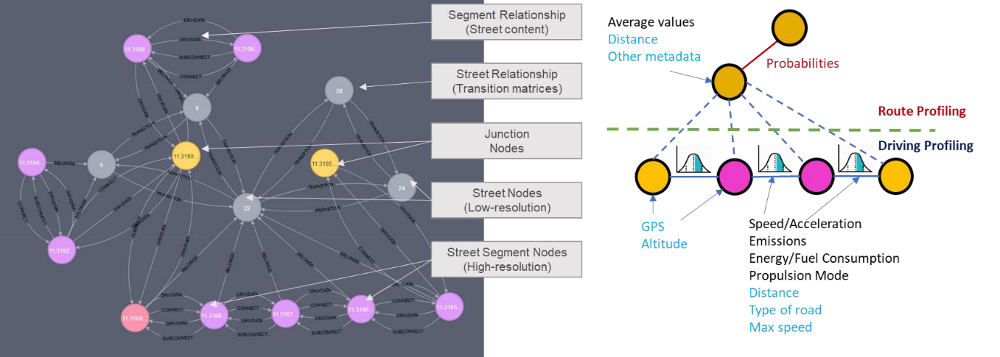

# 🛰️ FOrECaSt – Fleet Oriented Enhancements for Controls and Strategies

**FOrECaSt** is a service-oriented software framework designed to support the development, deployment, and maintenance of robust control strategies in connected vehicles. It enables modular, hardware-agnostic software development through a data-driven architecture that aligns with European data protection regulations and emerging mobility demands.

### 🌍 Motivation

The vehicle of the future will be a node in the Internet of Things. This evolution introduces not only technical opportunities but also regional challenges—including regulatory constraints like the EU’s General Data Protection Regulation (GDPR) and post Euro-6 emission standards. FOrECaSt responds to these needs by enabling cooperative, open, and flexible development of connected control strategies across vehicles, edge infrastructure, and personal devices.

---

## 🔧 Key Principles

### 1. **Modular and Service-Oriented Architecture**
Control features in FOrECaSt are implemented as modular software services, allowing interoperability and platform-agnostic deployment—from vehicle ECUs to edge nodes and personal devices.

### 2. **Data-Centric Functional Design**
FOrECaSt is built around a uniform data interface that governs how services exchange information. This design ensures functional robustness, testability, and ease of deployment across various system configurations.

### 3. **Openness and Standards Alignment**
FOrECaSt draws inspiration from open standards such as SAE J3049 and encourages contributions from the open-source community. Its modular, data-oriented foundation is well suited for both proprietary and collaborative innovation.

---

## 🧩 Core Functional Structures

The following three modules represent the foundational pillars of the FOrECaSt framework. Each is independently scalable, interoperable, and tightly integrated via the data-centric architecture that underpins the platform.

---

### 🚦 1. Traffic Simulation & Synthetic Data Generation

FOrECaSt enables generation of high-fidelity traffic scenarios through a multi-stage simulation pipeline that includes:

- Extraction of real-world networks from **OpenStreetMap**
- **Synthetic traffic generation** calibrated from empirical data
- **Mesoscopic and microscopic simulation** to model realistic vehicle flows
- Data-driven calibration of traffic demand and behavior using **machine learning**

This module acts as a **vehicle digital twin environment**, allowing robust testing of control strategies before deployment.

---

### 🌐 2. Knowledge Graph (Graph Database)

At the heart of FOrECaSt lies a **semantic knowledge graph** that integrates spatial, behavioral, and operational data. Its key features include:

- **Multi-layer graph structure**:
  - **Junction nodes & road segments** for physical infrastructure
  - **Street-level adjoint graphs** capturing vehicle intention and interaction
- Designed to support **graph traversal**, **statistical profiling**, and **data lineage**
- Enables **privacy-aware data aggregation** in alignment with GDPR principles

This representation is fundamental to all learning, profiling, and forecast activities within the system.

---

### 📈 3. Forecast Services & Control Strategy Analytics

Forecasting capabilities in FOrECaSt are derived from **statistical learning and graph analytics** that operate on both synthetic and in-service data. These services include:

- **Route profiling** via graph path search
- **Driving behavior modeling** using Gaussian Mixture Models
- **Data clustering** for behavioral segmentation
- **Smart scheduling** of control actions based on route, context, and risk

These services are deployed modularly across vehicle, edge, and cloud layers, and act as **strategy accelerators** for robust control implementation.

---

## 🧠 About the Functional Architecture

FOrECaSt is not a fixed solution—it is a **data-oriented framework** that supports multiple functional architectures tailored to different application domains. The **automotive-focused architecture** presented below serves as a reference implementation designed around **in-service emissions compliance** and connected vehicle use cases.

> The architecture emphasizes modularity, statistical validation, and knowledge generation through traffic simulation, data processing, and profiling. It represents just **one possible implementation** of the FOrECaSt framework and can be adapted for other domains such as logistics, smart cities, or predictive maintenance.

---

---

🔒 *The full source code is maintained in a private repository. For collaboration or research access, please contact the maintainers.*
